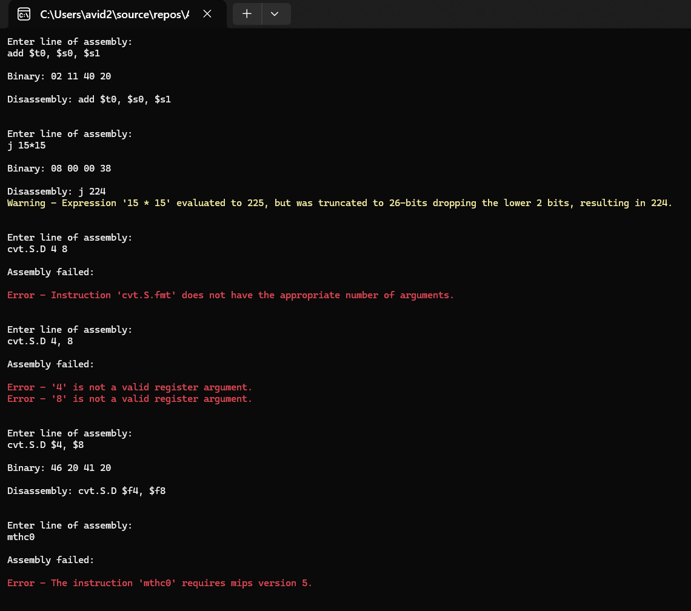

# MIPSer Instruction Parser

This Instruction Parser is the heart of the MIPSer assembler. It takes a tokenized string from a line of assembly that has been identified as an instruction, and converts it into a binary Instruction object ready to be encoded into the assembled binary file.

## Examples in use

Below is a screenshot of some instructions being parsed in the console tester.

These samples demonstrate support for both simple instructions like `add` as well as complex instruction like `cvt.S.fmt` (Convert from Single). Including with expression parsing as used in `j 15*15`.

There is also error and warning handling demonstrated, such as the jump instruction having a non-word aligned argument. The parser detects this, and drops a warning that the value will be truncated.

This image also demonstrates how error handling is handled not only line by line, but argument by argument and expression by expression. For the line `cvt.S.D 4, 8` it flags that both `4` and `8` are not valid register arguments.

