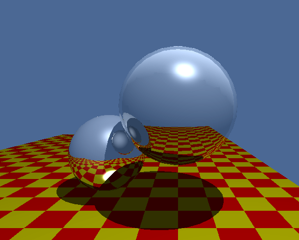
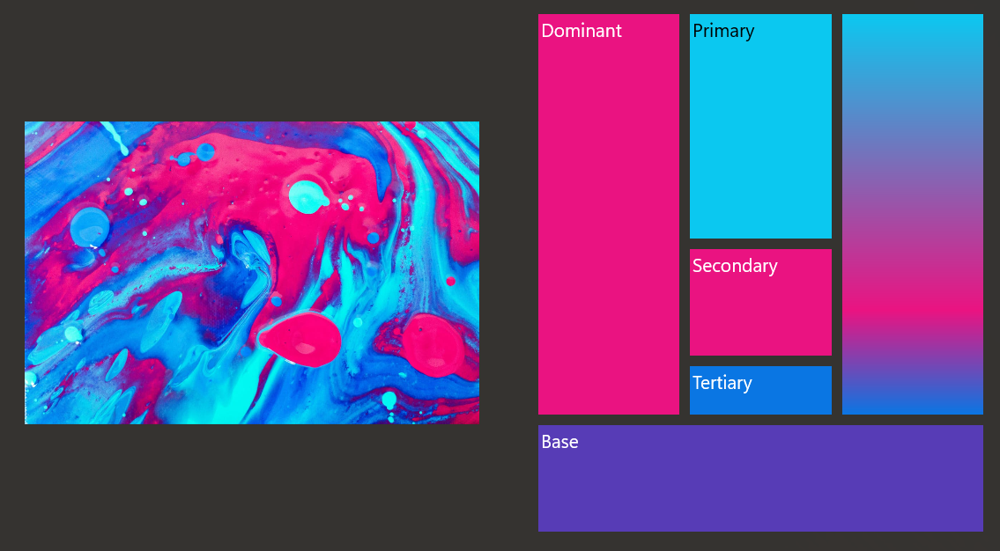

# Avishai Dernis WorkSample

This repo contains excerpts of code from my projects that I am especially proud of and I believe demonstrate my ability to write reliable, readable, and efficient code.

## Sample 1: [MIPS InstructionParser](/MIPS/)

This is an excerpt from my [MIPSer](https://github.com/Avid29/MIPSer) project. It parses tokenized lines of MIPS assembly into binary encoded instructions.

## Sample 2: [x86 Virtual Memory Managment](JOS/pmap.c)

This is an excerpt from my [final project in CSCI-352 at RIT](https://github.com/Avid29/CSCI352-Final/). It is the file containing virtual memory managing functions from a modified version of the JOS operating system, designed by MIT.

## Sample 3: [Ray Tracing Renderer](RenderSharp/RayTraceRenderer.cs)

This is an excerpt from my project [RenderSharp](https://github.com/Avid29/RenderSharp). It is an implementation of my IRenderer interface that will use ray tracing to render a scene of 3D objects to a texture buffer.

## Sample 4: [ColorPaletteSampler](ColorPaletteSampler/ColorPaletteSampler.cs)

This is an excerpt from the [Windows Community Toolkit Labs](https://github.com/CommunityToolkit/Labs-Windows). It is a helper I wrote to easily extract colors from an image and bind to them, all from with XAML.

###### *All code present is an excerpt of a larger project, and is most likely missing many dependencies. It should not compile.*
